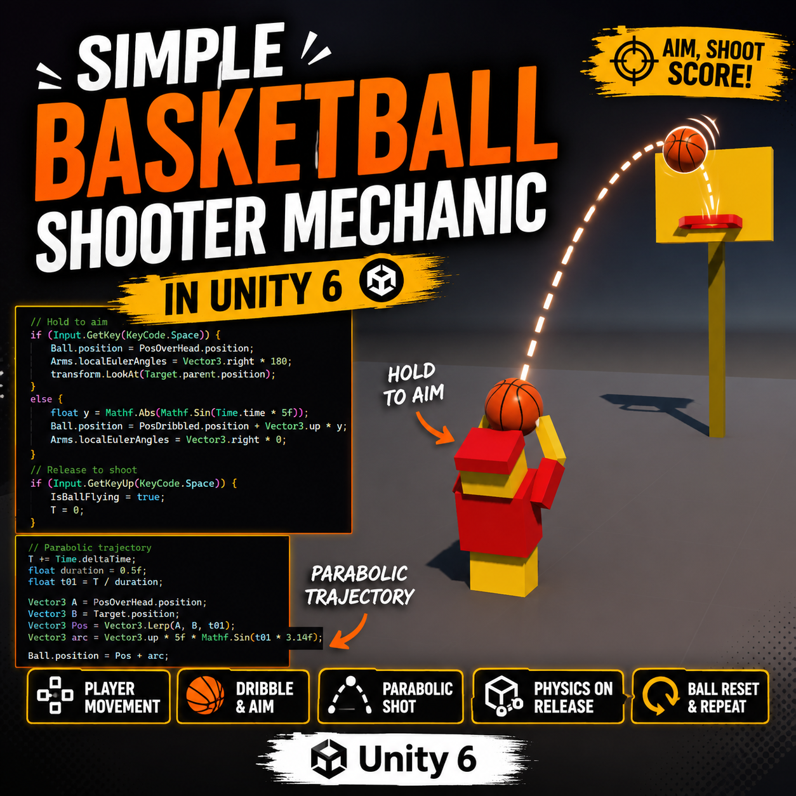
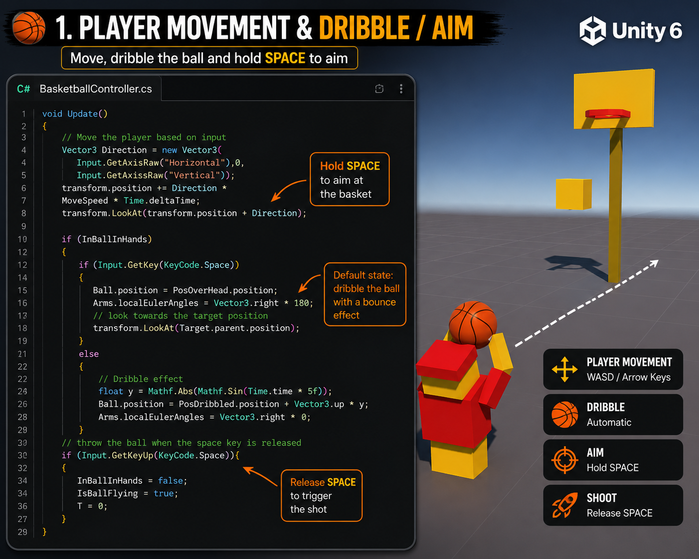
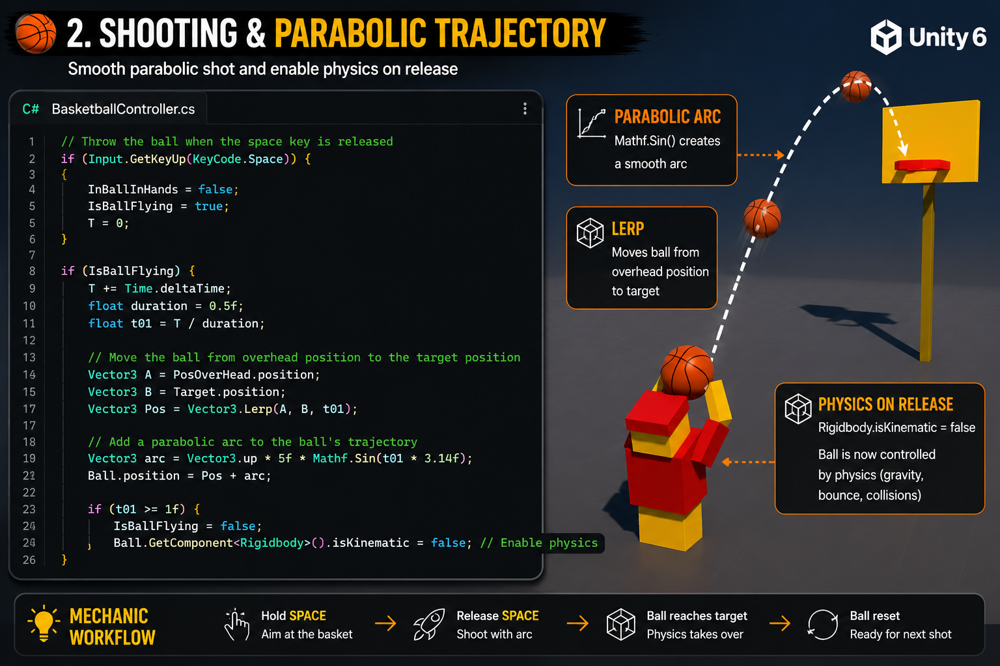
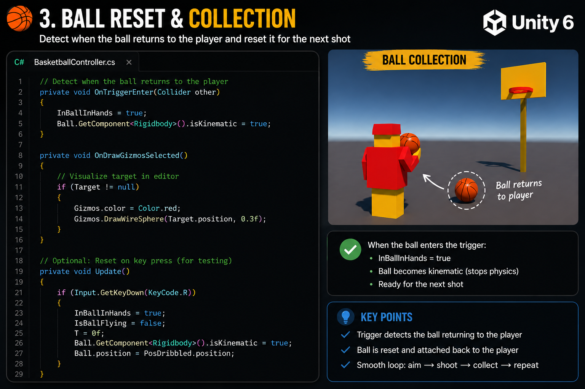
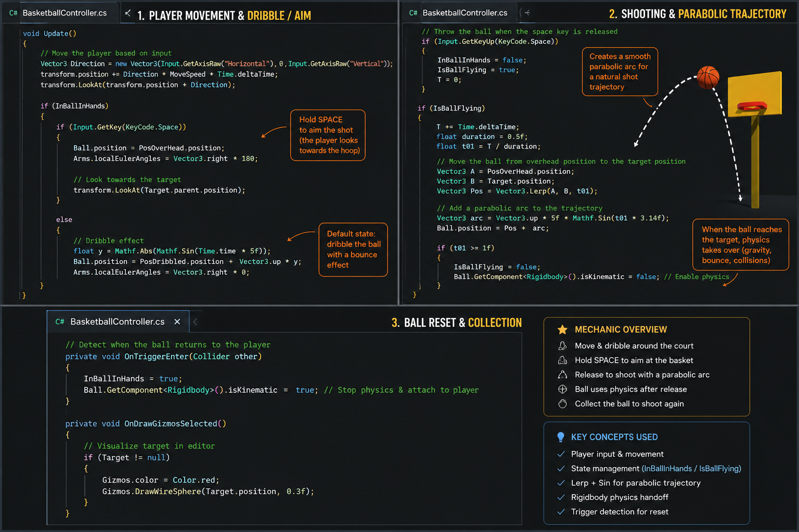

# 🏀 Unity Basketball Shooting Mechanic

A simple basketball shooting mechanic built in **Unity 6**, demonstrating player movement, dribbling, aiming, parabolic shooting, and ball reset using clean C# gameplay programming.

---

# 🎥 Demo

### 🎬 Watch the Gameplay

- 💼 **LinkedIn Post**
  
  https://www.linkedin.com/posts/abikarthick_building-a-simple-basketball-shooting-mechanic-ugcPost-7478459075438043137-5Qe3/?utm_source=share&utm_medium=member_desktop&rcm=ACoAAFSOB30BmmB1CU-K0qKbTzBatWHrXxYbp5U

- 🌐 **Portfolio**

  https://abikarthickgdev.github.io/GAMEDEV_PORTFOLIO/

- 🎥 **Gameplay Video**

  Videos/Basketball-hover.mp4

---

# 📸 Screenshots

### Player Movement



---

### Ball Dribbling



---

### Aiming System



---

### Shooting & Ball Trajectory



---

### Ball Collection & Reset



---

# 🎯 Features

- 🏀 Player movement
- 🤲 Automatic ball dribbling
- 🎯 Hold Space to aim
- 🔄 Automatic player rotation toward the hoop
- 📈 Smooth parabolic shooting trajectory
- ⚙️ Rigidbody physics after release
- 🔁 Ball collection and reset system

---

# 💻 Technologies Used

- Unity 6
- C#
- Unity Physics
- Rigidbody
- Transform
- Vector3.Lerp
- Mathf.Sin

---

# 📂 Repository Structure

```text
Unity-Basketball-Shooting-Mechanic
│
├── README.md
│
├── Images
│   ├── Screenshot-1.png
│   ├── Screenshot-2.png
│   ├── Screenshot-3.png
│   ├── Screenshot-4.png
│   └── Screenshot-5.png
│
├── Scripts
│   └── BasketballController.cs
│
└── Videos
    └── Basketball-hover.mp4
```

---

# 📜 Included Script

This repository contains the core gameplay implementation:

- ✅ BasketballController.cs

The complete Unity project is intentionally **not included**, as it contains project-specific assets, prefabs, scenes, and other files from my personal portfolio project.

---

# 🎮 Controls

| Action | Input |
|---------|------|
| Move | WASD / Arrow Keys |
| Aim | Hold Space |
| Shoot | Release Space |

---

# 🧠 Skills Demonstrated

- Gameplay Programming
- Player Controller
- State Management
- Ball Handling
- Dribble Animation
- Aiming System
- Parabolic Trajectory
- Rigidbody Physics
- Object Interaction
- Unity C#

---

# 🌐 Explore More

🎮 **Portfolio**

https://abikarthickgdev.github.io/GAMEDEV_PORTFOLIO/

💼 **LinkedIn**

https://www.linkedin.com/in/abikarthick

💻 **GitHub**

https://github.com/ABIKARTHICKGDEV

---

⭐ If you found this project interesting, feel free to explore my other Unity gameplay mechanics and game development projects.
